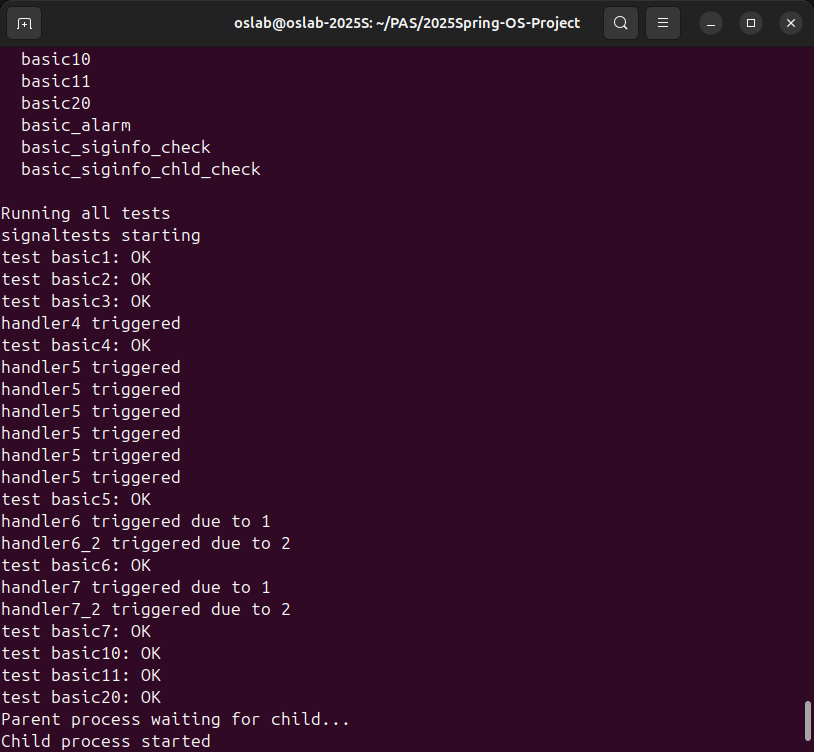
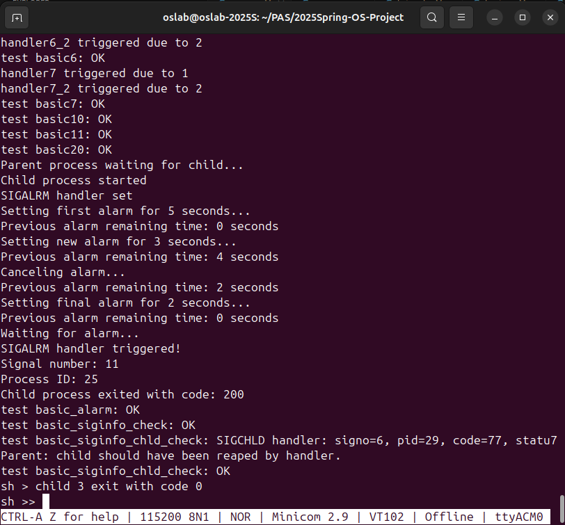

# RISC-V操作系统信号处理系统实现报告

## 12211308 袁龙 12213021 陈泽南 12213023 何家阳

## 1. 项目概述

本项目实现了一个符合POSIX标准的信号处理系统，该系统运行在RISC-V架构上。信号处理系统是操作系统中进程间通信的重要机制，允许进程接收和处理异步事件。项目分为三个主要阶段（Checkpoint）完成。

## 2. Checkpoint 1：基础信号处理机制实现

### 2.1 核心数据结构(已给出)

```c
struct ksignal {
    sigaction_t sa[SIGMAX + 1];     // 信号处理方式数组
    siginfo_t siginfos[SIGMAX + 1]; // 信号信息数组
    sigset_t sigmask;               // 掩码
    sigset_t sigpending;            // 待处理信号集
};

struct sigaction {
    void (*sa_sigaction)(int, siginfo_t*, void *); // 信号处理函数
    sigset_t sa_mask;                              // 处理信号时的掩码
    void (*sa_restorer)(void);                     // 信号处理完成后的恢复函数
};

struct siginfo {
    int si_signo;   // 信号编号
    int si_code;    // 信号产生的原因
    int si_pid;     // 发送信号的进程ID
    int si_status;  // 退出状态
    void* addr;     // 相关的内存地址
};
```

### 2.2 信号处理基本流程

1. 信号注册流程：
```c
int sys_sigaction(int signo, const sigaction_t __user *act, sigaction_t __user *oldact) {
    struct proc *p = curr_proc();
    struct mm *mm = p->mm;
    
    if (signo < SIGMIN || signo > SIGMAX)
        return -1;
        
    if (oldact != NULL) {
        acquire(&mm->lock);
        if (copy_to_user(mm, (uint64)oldact, (char*)&p->signal.sa[signo], sc:\Users\Lenovo\Downloads\report.pdfizeof(sigaction_t)) < 0) {
            release(&mm->lock);
            return -1;
        }
        release(&mm->lock);
    }
    
    if (act == NULL)
        return 0;
        
    if (signo == SIGKILL || signo == SIGSTOP)
        return -1;
        
    // Get the new handler
    sigaction_t kact;
    acquire(&mm->lock);
    if (copy_from_user(mm, (char*)&kact, (uint64)act, sizeof(sigaction_t)) < 0) {
        release(&mm->lock);
        return -1;
    }
    release(&mm->lock);
    p->signal.sa[signo] = kact;
    
    return 0;
}
```

2. 信号发送流程：
```c
int sys_sigkill(int pid, int signo, int code) {
    if (signo < SIGMIN || signo > SIGMAX)
        return -1;

    // Traverse the process pool to find the target process
    for (int i = 0; i < NPROC; i++) {
        struct proc *p = pool[i];
        acquire(&p->lock);
        if (p->pid == pid) {
            p->signal.sigpending |= sigmask(signo);
            p->signal.siginfos[signo].si_signo = signo;
            p->signal.siginfos[signo].si_code = code;
            p->signal.siginfos[signo].si_pid = curr_proc()->pid;
            
            if (p->state == SLEEPING) {
                p->state = RUNNABLE;
                add_task(p);
            }
            
            release(&p->lock);
            return 0;
        }
        release(&p->lock);
    }
    
    return -1;  // Target process not found
}
```

### 2.3 上下文保存与恢复

1. 上下文保存：
```c
struct ucontext kcontext;
kcontext.uc_sigmask = old_mask;
kcontext.uc_mcontext.epc = tf->epc;
memmove(kcontext.uc_mcontext.regs, &tf->ra, 31 * sizeof(uint64));
```

2. 上下文恢复：
```c
int sys_sigreturn() {
    struct proc *p = curr_proc();
    struct trapframe *tf = p->trapframe;
    
    struct ucontext kcontext;
    uint64 sp = tf->sp;
    
    // Skip the siginfo_t struct and the space reserved for arguments
    sp += 16;
    sp += sizeof(siginfo_t);
    sp = (sp + 0xf) & ~0xf; 
    
    // Retrieve ucontext
    acquire(&p->mm->lock);
    int ret = copy_from_user(p->mm, (char*)&kcontext, sp, sizeof(struct ucontext));
    release(&p->mm->lock);
    if (ret < 0) {
        return -1;
    }
    p->signal.sigmask = kcontext.uc_sigmask;
    memmove(&tf->ra,kcontext.uc_mcontext.regs, 31 * sizeof(uint64));
    
    return 0;
}
```

## 3. Checkpoint 2：SIGKILL特殊处理

### 3.1 SIGKILL的特性实现

1. 不可被忽略：
```c
if (signo == SIGKILL && sa->sa_sigaction == SIG_IGN) {
    setkilled(p, -10 - SIGKILL);
    return 0;
}
```

2. 不可被阻塞：
```c
// 在sigprocmask中确保SIGKILL不被阻塞
p->signal.sigmask &= ~sigmask(SIGKILL);
```

3. 不可被捕获：
```c
if (signo == SIGKILL && sa->sa_sigaction != SIG_DFL) {
    setkilled(p, -10 - SIGKILL);
    return 0;
}
```

### 3.2 进程终止实现(proc.c已给出)

```c
void setkilled(struct proc *p, int reason) {
    assert(reason < 0);
    acquire(&p->lock);
    p->killed = reason;
    release(&p->lock);
}
```

## 4. Checkpoint 3: Signal across fork and exec
Fork实现如下：
```dotnetcli
int siginit_fork(struct proc *parent, struct proc *child) {
    // 复制父进程的信号处理方式和信号掩码
    for (int i = SIGMIN; i <= SIGMAX; i++) {
        child->signal.sa[i] = parent->signal.sa[i];
    }
    
    // 继承父进程的信号掩码
    child->signal.sigmask = parent->signal.sigmask;
    
    // 清空所有pending信号
    child->signal.sigpending = 0;
    memset(child->signal.siginfos, 0, sizeof(child->signal.siginfos));
    
    return 0;
}

```
在fork 时，子进程继承父进程的signal处理方式(sigaction)、signal mask，并且清空所有 pending signal。


Exec实现如下：

```dotnetcli

int siginit_exec(struct proc *p) {
    // 保存当前的信号掩码和pending信号
    sigset_t old_mask = p->signal.sigmask;
    sigset_t old_pending = p->signal.sigpending;
    siginfo_t old_infos[SIGMAX + 1];
    memmove(old_infos, p->signal.siginfos, sizeof(old_infos));
    
    // 重置所有信号处理方式为默认，除了被忽略的信号
    for (int i = SIGMIN; i <= SIGMAX; i++) {
        if (p->signal.sa[i].sa_sigaction != SIG_IGN) {
            p->signal.sa[i].sa_sigaction = SIG_DFL;
            p->signal.sa[i].sa_mask = 0;
            p->signal.sa[i].sa_restorer = NULL;
        }
    }
    
    // 恢复信号掩码和pending信号
    p->signal.sigmask = old_mask;
    p->signal.sigpending = old_pending;
    memmove(p->signal.siginfos, old_infos, sizeof(old_infos));
    
    return 0;
}
```
在exec 时，子进程重置所有的signal处理方式为默认值，并且保留被手动指定为ignore的那些sigaction，signal mask 以及 pending signal 不变。

## Basic check123 结果如下：


## 5.自选Checkpoint:
### 5.1.1 SIGALARM
参考：alarm(2)。需要设计一个系统调用，它能设置一个时钟，在n秒后向用户进程发起一次信号SIGALRM。
```
unsigned int alarm(unsigned int seconds);
```
- alarm() 在指定的秒数后向调用进程发送SIGALRM信号
- 如果seconds为0，则取消任何待处理的alarm
- alarm() 返回之前设置的alarm的剩余秒数，如果没有之前设置的alarm则返回0

### 5.1.2保存时钟状态的数据结构
```c
struct {
    struct spinlock lock;
    uint64 alarm_time;  // 以CPU周期为单位的alarm时间
} alarm_state;
```
- 使用自旋锁保护对`alarm_time`的访问
- `alarm_time`以CPU周期为单位存储时间

#### 5.1.3 alarm系统调用
```c
unsigned int alarm(unsigned int seconds) {
    struct proc *p = curr_proc();
    uint64 current_time = r_time();
    unsigned int remaining = 0;
    
    acquire(&alarm_state.lock);
    
    // 如果seconds为0，取消现有的alarm
    if (seconds == 0) {
        if (alarm_state.alarm_time > current_time) {
            remaining = (alarm_state.alarm_time - current_time) / CPU_FREQ;
        }
        alarm_state.alarm_time = 0;
    } else {
        // 计算新的alarm时间
        uint64 new_alarm_time = current_time + seconds * CPU_FREQ;
        
        // 如果已有alarm，计算剩余时间
        if (alarm_state.alarm_time > current_time) {
            remaining = (alarm_state.alarm_time - current_time) / CPU_FREQ;
        }
        
        // 设置新的alarm时间
        alarm_state.alarm_time = new_alarm_time;
    }
    
    release(&alarm_state.lock);
    return remaining;
}
```

#### 5.1.4 定时器检查函数
```c
void check_alarm(void) {
    struct proc *p = curr_proc();
    if (p == NULL) {
        return;  // 如果没有当前进程，直接返回
    }
    
    uint64 current_time = r_time();
    
    acquire(&alarm_state.lock);
    if (alarm_state.alarm_time > 0 && current_time >= alarm_state.alarm_time) {
        // 发送SIGALRM信号
        acquire(&p->lock);
        p->signal.sigpending |= sigmask(SIGALRM);
        p->signal.siginfos[SIGALRM].si_signo = SIGALRM;
        p->signal.siginfos[SIGALRM].si_pid = p->pid;
        release(&p->lock);
        
        // 清除alarm时间
        alarm_state.alarm_time = 0;
    }
    release(&alarm_state.lock);
}
```

#### 5.1.5 测试验证
1. **基本功能测试**（对应Checkpoint要求：在指定秒数后发送SIGALRM信号）
   - 设置5秒alarm
   - 验证返回值为0（之前没有alarm）
   - 验证信号在正确时间发送

2. **取消alarm测试**（对应Checkpoint要求：如果seconds为0，取消任何待处理的alarm）
   - 等待1秒后设置新alarm
   - 验证返回剩余时间
   - 取消alarm并验证返回剩余时间
   - 验证alarm确实被取消（不会触发信号）

实现：
```
// alarm信号处理函数
void handler_alarm(int signo, siginfo_t* info, void* ctx) {
    assert(signo == SIGALRM);
    assert(info->si_signo == SIGALRM);
    assert(info->si_pid == getpid());
    fprintf(1, "SIGALRM handler triggered!\n");
    fprintf(1, "Signal number: %d\n", signo);
    fprintf(1, "Process ID: %d\n", info->si_pid);
    exit(200);
}

// 测试alarm系统调用
void basic_alarm(char* s) {
    int pid = fork();
    if (pid == 0) {
        fprintf(1, "Child process started\n");
    
        sigaction_t sa = {
            .sa_sigaction = handler_alarm,
            .sa_restorer = sigreturn,
        };
        sigemptyset(&sa.sa_mask);
        sigaction(SIGALRM, &sa, 0);
        fprintf(1, "SIGALRM handler set\n");
        
        fprintf(1, "Setting first alarm for 5 seconds...\n");
        unsigned int remaining = alarm(5);
        fprintf(1, "Previous alarm remaining time: %d seconds\n", remaining);
        assert_eq(remaining, 0);  
        
        sleep(1);  
        fprintf(1, "Setting new alarm for 3 seconds...\n");
        remaining = alarm(3);
        fprintf(1, "Previous alarm remaining time: %d seconds\n", remaining);
        assert(remaining > 0); 
        sleep(1);  
        fprintf(1, "Canceling alarm...\n");
        remaining = alarm(0);
        fprintf(1, "Previous alarm remaining time: %d seconds\n", remaining);
        assert(remaining > 0); 
        
        fprintf(1, "Setting final alarm for 2 seconds...\n");
        remaining = alarm(2);
        fprintf(1, "Previous alarm remaining time: %d seconds\n", remaining);
        assert_eq(remaining, 0);  
        fprintf(1, "Waiting for alarm...\n");
        while(1);
        exit(1);
    } else {
        fprintf(1, "Parent process waiting for child...\n");
        int ret;
        wait(0, &ret);
        fprintf(1, "Child process exited with code: %d\n", ret);
        assert_eq(ret, 200);  // 信号处理函数应该返回200
    }
}
```
### 5.2  Checkpoint- siginfo

在每次进入 userspace signal handler 前，即在`do_signal`中在用户栈上构造siginfo结构体，并将它传给用户模式sigactionhandler

```c
int do_signal(void) {
    ...

  siginfo_t *kinfo = &p->signal.siginfos[signo];
    kinfo->si_signo  = signo;
    // 如果 si_pid 已由 sys_sigkill 设置则保持，否则置为 -1（内核触发）
    kinfo->si_pid    = (kinfo->si_pid != 0 ? kinfo->si_pid : -1);
    if(kinfo->si_signo != SIGCHLD){
        kinfo->si_code   = 0;
        kinfo->si_status = 0;
    }
    kinfo->addr      = NULL;
    printf("do_signal: signo=%d, pid=%d, code=%d, status=%d\n", 
                    signo, 
                    kinfo->si_pid, 
                    kinfo->si_code, 
                    kinfo->si_status);

    // 为siginfo预留空间
    sp -= sizeof(siginfo_t);
    sp &= ~0xf;  // 16字节对齐
    uint64 siginfo_addr = sp;

    ...

    copy_to_user(mm, siginfo_addr, (char*)kinfo, sizeof(siginfo_t))

}
    
```

对该checkpoint的basic test如下：
由于我们在自选checkpoint中未实现由内核发送的signal信号，因此这里仅测试由进程发送的signal， `sigkill(pid, SIGUSR1, 2);` 
```c
// 验证 siginfo_t 结构体的各字段：
// si_signo  应是 SIGUSR1
// si_pid    应是发送者（parent）的 pid
// si_code   应为 0
// si_status 应为 0
// addr      应为 NULL
void siginfo_handler(int signo, siginfo_t *info, void *ctx) {
    printf("Check signo=%d, pid=%d, code=%d, status=%d\n", info->si_signo, info->si_pid, info->si_code, info->si_status);

    // 检查信号编号
    assert(signo == SIGUSR1);
    // 检查 si_signo
    assert(info->si_signo == SIGUSR1);
    // 检查 si_pid（父进程发送）
    int ppid = getppid();
    assert(info->si_pid == ppid);
    // 检查其他字段
    assert(info->si_code == 0);
    assert(info->si_status == 0);
    assert(info->addr == NULL);

    // 如果都通过，则退出并返回特定码
    exit(123);
}

void basic_siginfo_check(char *s) {
    // 在子进程安装 handler
    int pid = fork();
    if (pid == 0) {
        sigaction_t sa = {
            .sa_sigaction = siginfo_handler,
            .sa_restorer  = sigreturn,
        };
        sigemptyset(&sa.sa_mask);
        sigaction(SIGUSR1, &sa, NULL);

        // 等待信号
        while (1) sleep(1);
    } else {
        // 父进程稍等，让子进程安装好 handler
        sleep(5);
        // 由父进程发送 SIGUSR1
        sigkill(pid, SIGUSR1, 2);

        // 等待子进程退出并检查它的 exit code
        int status;
        wait(0, &status);
        // 我们在 handler 里用 exit(123)，因此这里应该收到 123
        assert_eq(status, 123);
    }
}
```
### 5.3 SIGCHLD
在这个Checkpoint中，我们在进程的exit函数中增加了向其父进程传递SIGCHLD信号的逻辑，并在do_signal函数中进行相应的操作，最后设计了一个testcases来实现handler函数对信号的自动处理功能。相应代码如下：
1. exit函数发出SIGCHLD信号
```c
if (parent) {
        acquire(&parent->lock);
        parent->signal.sigpending |= sigmask(SIGCHLD);
        parent->signal.siginfos[SIGCHLD].si_signo = SIGCHLD;
        parent->signal.siginfos[SIGCHLD].si_pid = p->pid;
        parent->signal.siginfos[SIGCHLD].si_code = code; // 退出码
        parent->signal.siginfos[SIGCHLD].si_status = 0;
        parent->signal.siginfos[SIGCHLD].addr = NULL;
        release(&parent->lock);
    }
```

2. do_signal中对SIGCHLD保留siginfo中的数据：
```c
if(kinfo->si_signo != SIGCHLD){
        kinfo->si_code   = 0;
        kinfo->si_status = 0;
    }
```

3. testcase中handler的实现：
```c
void siginfo_chld_handler(int signo, siginfo_t *info, void *ctx) {
    assert(signo == SIGCHLD);
    assert(info->si_signo == SIGCHLD);
    assert(info->si_pid > 0);                 // 子进程 pid
    int status;
    int ret = wait(info->si_pid, &status);
    assert(ret == info->si_pid);               // 回收的就是发送信号的子进程
    assert(info->si_code == 77);               // 你的实现：退出码放在 si_code
    printf("SIGCHLD handler: signo=%d, pid=%d, code=%d, status=%d\n",
        info->si_signo, info->si_pid, info->si_code, status);
}

void basic_siginfo_chld_check(char *s) {
    int pid = fork();
    
    if (pid == 0) {
        exit(77);
    } else {
        sigaction_t sa = {
            .sa_sigaction = siginfo_chld_handler,
            .sa_restorer  = sigreturn,
        };
        sigemptyset(&sa.sa_mask);
        sigaction(SIGCHLD, &sa, NULL);
        sleep(5);
        printf("Parent: child should have been reaped by handler.\n");
    }
}
```
### 5.4 自选Checkpoints 结果（解释和实现如上）：
