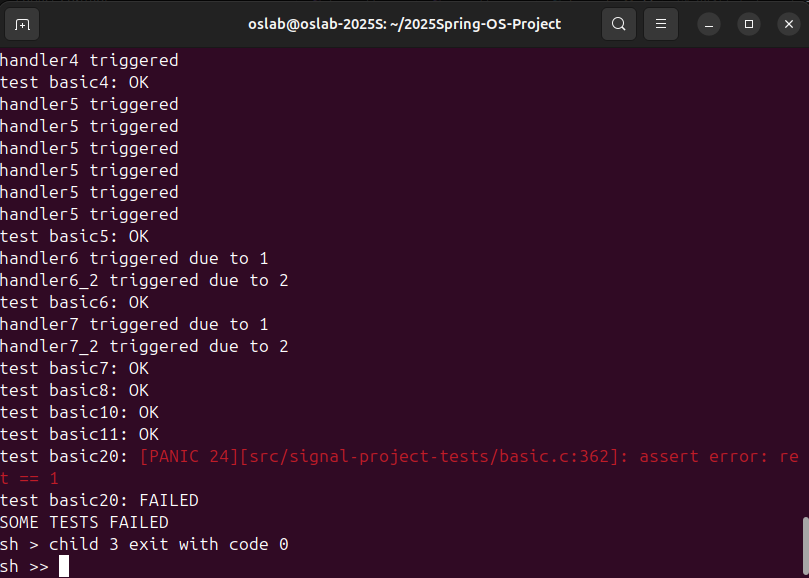

# RISC-V操作系统信号处理系统实现报告

## 1. 项目概述

本项目实现了一个符合POSIX标准的信号处理系统，该系统运行在RISC-V架构上。信号处理系统是操作系统中进程间通信的重要机制，允许进程接收和处理异步事件。项目分为三个主要阶段（Checkpoint）完成。

## 2. Checkpoint 1：基础信号处理机制实现

### 2.1 核心数据结构(已给出)

```c
struct ksignal {
    sigaction_t sa[SIGMAX + 1];     // 信号处理方式数组
    siginfo_t siginfos[SIGMAX + 1]; // 信号信息数组
    sigset_t sigmask;               // 掩码
    sigset_t sigpending;            // 待处理信号集
};

struct sigaction {
    void (*sa_sigaction)(int, siginfo_t*, void *); // 信号处理函数
    sigset_t sa_mask;                              // 处理信号时的掩码
    void (*sa_restorer)(void);                     // 信号处理完成后的恢复函数
};

struct siginfo {
    int si_signo;   // 信号编号
    int si_code;    // 信号产生的原因
    int si_pid;     // 发送信号的进程ID
    int si_status;  // 退出状态
    void* addr;     // 相关的内存地址
};
```

### 2.2 信号处理基本流程

1. 信号注册流程：
```c
int sys_sigaction(int signo, const sigaction_t __user *act, sigaction_t __user *oldact) {
    struct proc *p = curr_proc();
    struct mm *mm = p->mm;
    
    if (signo < SIGMIN || signo > SIGMAX)
        return -1;
        
    if (oldact != NULL) {
        acquire(&mm->lock);
        if (copy_to_user(mm, (uint64)oldact, (char*)&p->signal.sa[signo], sizeof(sigaction_t)) < 0) {
            release(&mm->lock);
            return -1;
        }
        release(&mm->lock);
    }
    
    if (act == NULL)
        return 0;
        
    if (signo == SIGKILL || signo == SIGSTOP)
        return -1;
        
    // Get the new handler
    sigaction_t kact;
    acquire(&mm->lock);
    if (copy_from_user(mm, (char*)&kact, (uint64)act, sizeof(sigaction_t)) < 0) {
        release(&mm->lock);
        return -1;
    }
    release(&mm->lock);
    p->signal.sa[signo] = kact;
    
    return 0;
}
```

2. 信号发送流程：
```c
int sys_sigkill(int pid, int signo, int code) {
    if (signo < SIGMIN || signo > SIGMAX)
        return -1;

    // Traverse the process pool to find the target process
    for (int i = 0; i < NPROC; i++) {
        struct proc *p = pool[i];
        acquire(&p->lock);
        if (p->pid == pid) {
            p->signal.sigpending |= sigmask(signo);
            p->signal.siginfos[signo].si_signo = signo;
            p->signal.siginfos[signo].si_code = code;
            p->signal.siginfos[signo].si_pid = curr_proc()->pid;
            
            if (p->state == SLEEPING) {
                p->state = RUNNABLE;
                add_task(p);
            }
            
            release(&p->lock);
            return 0;
        }
        release(&p->lock);
    }
    
    return -1;  // Target process not found
}
```

### 2.3 上下文保存与恢复

1. 上下文保存：
```c
struct ucontext kcontext;
kcontext.uc_sigmask = old_mask;
kcontext.uc_mcontext.epc = tf->epc;
memmove(kcontext.uc_mcontext.regs, &tf->ra, 31 * sizeof(uint64));
```

2. 上下文恢复：
```c
int sys_sigreturn() {
    struct proc *p = curr_proc();
    struct trapframe *tf = p->trapframe;
    
    struct ucontext kcontext;
    uint64 sp = tf->sp;
    
    // Skip the siginfo_t struct and the space reserved for arguments
    sp += 16;
    sp += sizeof(siginfo_t);
    sp = (sp + 0xf) & ~0xf; 
    
    // Retrieve ucontext
    acquire(&p->mm->lock);
    int ret = copy_from_user(p->mm, (char*)&kcontext, sp, sizeof(struct ucontext));
    release(&p->mm->lock);
    if (ret < 0) {
        return -1;
    }
    p->signal.sigmask = kcontext.uc_sigmask;
    memmove(&tf->ra,kcontext.uc_mcontext.regs, 31 * sizeof(uint64));
    
    return 0;
}
```

## 3. Checkpoint 2：SIGKILL特殊处理

### 3.1 SIGKILL的特性实现

1. 不可被忽略：
```c
if (signo == SIGKILL && sa->sa_sigaction == SIG_IGN) {
    setkilled(p, -10 - SIGKILL);
    return 0;
}
```

2. 不可被阻塞：
```c
// 在sigprocmask中确保SIGKILL不被阻塞
p->signal.sigmask &= ~sigmask(SIGKILL);
```

3. 不可被捕获：
```c
if (signo == SIGKILL && sa->sa_sigaction != SIG_DFL) {
    setkilled(p, -10 - SIGKILL);
    return 0;
}
```

### 3.2 进程终止实现(proc.c已给出)

```c
void setkilled(struct proc *p, int reason) {
    assert(reason < 0);
    acquire(&p->lock);
    p->killed = reason;
    release(&p->lock);
}
```

## 4. 测试验证
运行测试文件如下:


```