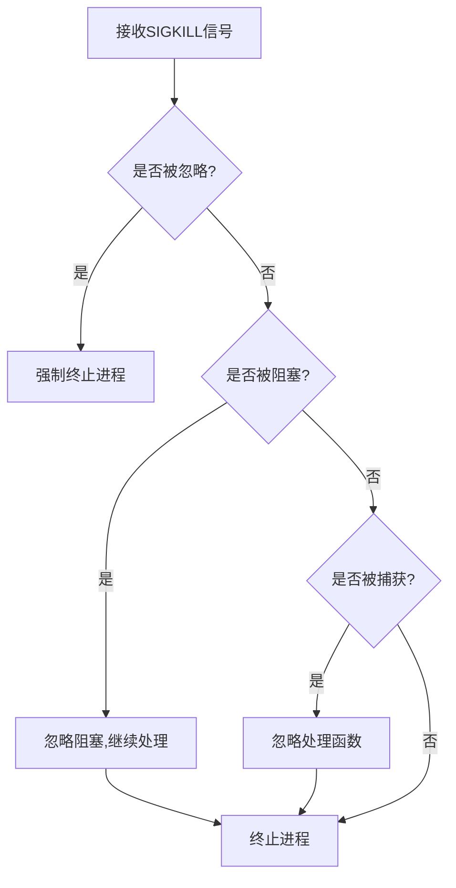

# RISC-V操作系统信号处理系统实现报告

## 1. 项目概述

本项目实现了一个符合POSIX标准的信号处理系统，该系统运行在RISC-V架构上。信号处理系统是操作系统中进程间通信的重要机制，允许进程接收和处理异步事件。项目分为三个主要阶段（Checkpoint）完成。

## 2. Checkpoint 1：基础信号处理机制实现

### 2.1 核心数据结构

```c
// 信号处理结构体
struct ksignal {
    sigaction_t sa[SIGMAX + 1];     // 信号处理方式数组
    siginfo_t siginfos[SIGMAX + 1]; // 信号信息数组
    sigset_t sigmask;               // 信号掩码
    sigset_t sigpending;            // 待处理信号集
};

// 信号处理函数结构体
struct sigaction {
    void (*sa_sigaction)(int, siginfo_t*, void *); // 信号处理函数
    sigset_t sa_mask;                              // 处理信号时的掩码
    void (*sa_restorer)(void);                     // 信号处理完成后的恢复函数
};

// 信号信息结构体
struct siginfo {
    int si_signo;   // 信号编号
    int si_code;    // 信号产生的原因
    int si_pid;     // 发送信号的进程ID
    int si_status;  // 退出状态
    void* addr;     // 相关的内存地址
};
```

### 2.2 信号处理基本流程

1. 信号注册流程：
```c
int sys_sigaction(int signo, const sigaction_t *act, sigaction_t *oldact) {
    struct proc *p = curr_proc();
    struct mm *mm = p->mm;
    
    // 1. 验证信号编号
    if (signo < SIGMIN || signo > SIGMAX)
        return -1;
        
    // 2. 保存旧的处理方式
    if (oldact != NULL) {
        if (copy_to_user(mm, oldact, &p->signal.sa[signo], sizeof(sigaction_t)) < 0)
            return -1;
    }
    
    // 3. 设置新的处理方式
    if (act != NULL) {
        sigaction_t kact;
        if (copy_from_user(mm, &kact, act, sizeof(sigaction_t)) < 0)
            return -1;
        p->signal.sa[signo] = kact;
    }
    
    return 0;
}
```

2. 信号发送流程：
```c
int sys_sigkill(int pid, int signo, int code) {
    // 1. 查找目标进程
    struct proc *p = find_proc(pid);
    if (!p) return -1;
    
    // 2. 设置pending信号
    p->signal.sigpending |= sigmask(signo);
    
    // 3. 填充siginfo结构
    p->signal.siginfos[signo].si_signo = signo;
    p->signal.siginfos[signo].si_code = code;
    p->signal.siginfos[signo].si_pid = curr_proc()->pid;
    
    return 0;
}
```

### 2.3 上下文保存与恢复

1. 上下文保存：
```c
// 在do_signal中保存上下文
struct ucontext kcontext;
kcontext.uc_sigmask = old_mask;
kcontext.uc_mcontext.epc = tf->epc;
memmove(kcontext.uc_mcontext.regs, &tf->ra, 31 * sizeof(uint64));
```

2. 上下文恢复：
```c
int sys_sigreturn() {
    struct proc *p = curr_proc();
    struct trapframe *tf = p->trapframe;
    
    // 从用户栈恢复上下文
    struct ucontext kcontext;
    copy_from_user(p->mm, &kcontext, tf->sp, sizeof(struct ucontext));
    
    // 恢复信号掩码和寄存器
    p->signal.sigmask = kcontext.uc_sigmask;
    memmove(&tf->ra, kcontext.uc_mcontext.regs, 31 * sizeof(uint64));
    
    return 0;
}
```

## 3. Checkpoint 2：SIGKILL特殊处理

### 3.1 SIGKILL的特性实现

1. 不可被忽略：
```c
if (signo == SIGKILL && sa->sa_sigaction == SIG_IGN) {
    setkilled(p, -10 - SIGKILL);
    return 0;
}
```

2. 不可被阻塞：
```c
// 在sigprocmask中确保SIGKILL不被阻塞
p->signal.sigmask &= ~sigmask(SIGKILL);
```

3. 不可被捕获：
```c
if (signo == SIGKILL && sa->sa_sigaction != SIG_DFL) {
    setkilled(p, -10 - SIGKILL);
    return 0;
}
```

### 3.2 进程终止实现

```c
void setkilled(struct proc *p, int reason) {
    assert(reason < 0);
    acquire(&p->lock);
    p->killed = reason;  // SIGKILL使用-14作为退出码
    release(&p->lock);
}
```

### 3.3 SIGKILL处理流程



## 4. Checkpoint 3：Fork和Exec信号处理

### 4.1 Fork时的信号继承

```c
int siginit_fork(struct proc *parent, struct proc *child) {
    // 1. 复制信号处理方式
    for (int i = SIGMIN; i <= SIGMAX; i++) {
        child->signal.sa[i] = parent->signal.sa[i];
    }
    
    // 2. 继承信号掩码
    child->signal.sigmask = parent->signal.sigmask;
    
    // 3. 清空pending信号
    child->signal.sigpending = 0;
    memset(child->signal.siginfos, 0, sizeof(child->signal.siginfos));
    
    return 0;
}
```

### 4.2 Exec时的信号处理

```c
int siginit_exec(struct proc *p) {
    // 1. 保存现有状态
    sigset_t old_mask = p->signal.sigmask;
    sigset_t old_pending = p->signal.sigpending;
    siginfo_t old_infos[SIGMAX + 1];
    memmove(old_infos, p->signal.siginfos, sizeof(old_infos));
    
    // 2. 重置信号处理方式
    for (int i = SIGMIN; i <= SIGMAX; i++) {
        if (p->signal.sa[i].sa_sigaction != SIG_IGN) {
            p->signal.sa[i].sa_sigaction = SIG_DFL;
            p->signal.sa[i].sa_mask = 0;
            p->signal.sa[i].sa_restorer = NULL;
        }
    }
    
    // 3. 恢复信号掩码和pending信号
    p->signal.sigmask = old_mask;
    p->signal.sigpending = old_pending;
    memmove(p->signal.siginfos, old_infos, sizeof(old_infos));
    
    return 0;
}
```

### 4.3 信号状态继承规则

1. Fork继承规则：
- 子进程继承父进程的信号处理方式
- 子进程继承父进程的信号掩码
- 子进程的pending信号集为空

2. Exec继承规则：
- 重置所有非忽略信号为默认处理
- 保持被设置为忽略的信号状态
- 保持原有的信号掩码
- 保持原有的pending信号

## 5. 测试验证

### 5.1 Checkpoint 1测试

```c
// 基本信号处理测试
void basic1(char* s) {
    int pid = fork();
    if (pid == 0) {
        sleep(10);
        exit(1);
    } else {
        sigkill(pid, SIGUSR0, 0);
        int ret;
        wait(0, &ret);
        assert(ret == -10 - SIGUSR0);
    }
}
```

### 5.2 Checkpoint 2测试

```c
// SIGKILL特性测试
void basic10(char* s) {
    int pid = fork();
    if (pid == 0) {
        sigaction_t sa = {
            .sa_sigaction = handler10,
            .sa_restorer = NULL,
        };
        sigaction(SIGKILL, &sa, 0); 
        while (1);
        exit(1);
    } else {
        sleep(20);
        sigkill(pid, SIGKILL, 0);
        int ret;
        wait(0, &ret);
        assert(ret == -10 - SIGKILL);
    }
}
```

### 5.3 Checkpoint 3测试

```c
// Fork/Exec信号继承测试
void basic20(char *s) {
    sigaction_t sa = {
        .sa_sigaction = SIG_IGN,
        .sa_restorer  = NULL,
    };
    sigaction(SIGUSR0, &sa, 0);

    int pid = fork();
    if (pid == 0) {
        sigkill(getpid(), SIGUSR0, 0); 
        exit(1);
    } else {
        int ret;
        wait(0, &ret);
        assert(ret == 1);
    }
}
```

## 6. 总结与反思

### 6.1 实现要点

1. Checkpoint 1：
- 实现了基本的信号处理机制
- 确保了上下文切换的正确性
- 实现了信号处理函数的调用机制

2. Checkpoint 2：
- 正确处理了SIGKILL的特殊性质
- 实现了强制终止进程的机制
- 保证了SIGKILL的不可忽略性

3. Checkpoint 3：
- 实现了正确的信号继承机制
- 确保了Fork和Exec时的信号状态转换
- 维护了信号处理的一致性

### 6.2 技术难点

1. 用户态和内核态切换时的上下文保存与恢复
2. 信号处理的原子性保证
3. 进程状态的正确维护
4. 内存访问的安全性保证

### 6.3 改进方向

1. 实现更多类型的信号
2. 优化信号处理的性能
3. 增强信号处理的可靠性
4. 完善调试功能

## 7. 参考资料

1. POSIX.1-2017 标准文档
2. RISC-V 特权级规范
3. Linux 信号处理实现
4. xv6-riscv 操作系统源码 